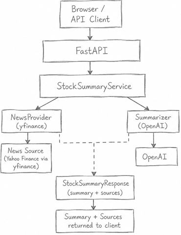
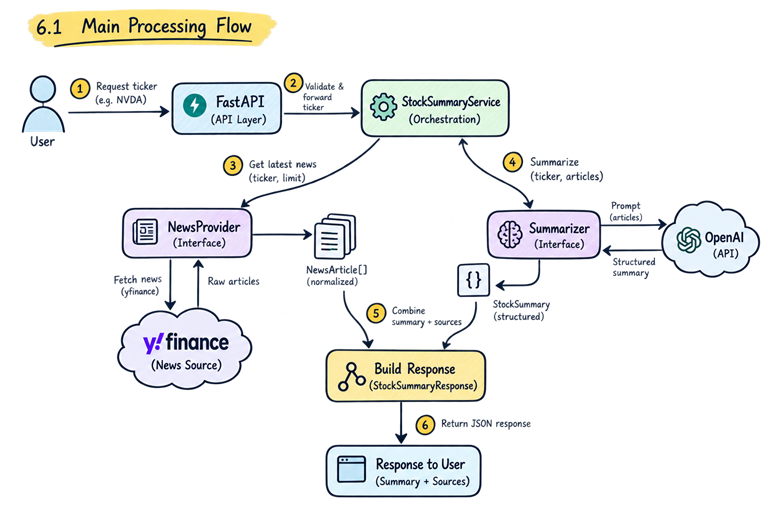

# Software Requirements Specification and Requirements Analysis

## 1. Purpose
The purpose of the proposed application is to provide traders with a concise, AI-generated summary of the latest news related to a selected stock.<br >
The system is intended to help users quickly understand recent developments affecting a stock without manually reading multiple news articles.<br >
The application is expected to be small, easy to run locally, easy to understand, and designed in a way that allows future extension.

## 2. Proposed Scope
The system should allow a user to provide a stock ticker such as:
- NVDA 
- AAPL 
- MSFT 
- TSLA

The system will then:
- accept the ticker;
- retrieve recent news for the stock;
- normalize the retrieved articles;
- provide the articles to an AI summarization service;
- generate a structured stock-news summary;
- return the summary together with the original news sources.

#### The proposed high-level architecture is:



## 3. Stakeholders

The primary user is a trader or investor who wants a quick overview of recent news affecting a stock.<br >
A secondary stakeholder is the software engineer or reviewer who must be able to run, understand, test, and extend the application.

## 4. Functional Requirements
### FR-1: Stock Ticker Input
The system shall allow the user to provide a stock ticker.

Example: NVDA 

The proposed API could expose an endpoint such as: 

- GET /api/stocks/{ticker}/summary 

The system shall validate the input before attempting to retrieve news.

### FR-2: Retrieve Latest News
The system shall retrieve a limited number of recent news articles related to the requested stock.

A **NewsProvider** abstraction shall be used so that the application is not tightly coupled to one external source.

The initial implementation may use **yfinance** because it provides stock-related news without requiring an additional API key.
### FR-3: Normalize News Data
External news-provider responses shall be converted into a common internal format.

Each normalized article should contain:
- title 
- summary 
- source 
- url 
- published_at

This ensures that the rest of the application does not depend on provider-specific response structures.
### FR-4: Generate AI Summary
The system shall send the selected news articles to OpenAI and request a structured summary.

The proposed summary should contain:<br >
- overview 
- key developments 
- sentiment 
- what to watch 

The model shall be instructed to base the response on the supplied articles rather than inventing unsupported information.

### FR-5: Return Sources
The generated response shall include the source articles used to produce the summary.

This provides transparency and allows the user to inspect the original information.

### FR-6: Handle Errors
The system shall handle expected failures such as:
- invalid ticker;
- no recent news found;
- unavailable news provider;
- unavailable AI service;
- missing OpenAI API key.

The application should return clear error responses instead of exposing internal exceptions.

## 5. Non-Functional Requirements

### NFR-1: Maintainability
The design should clearly separate:

**HTTP/API concerns** -|- **Business logic** -|- **External integrations**

This should make the application easier to understand and modify.

### NFR-2: Extensibility
The system should allow external dependencies to be replaced without significant changes to the rest of the application.<br >
For example:
`````
              NewsProvider 
                   | 
      +------------+-------------+
      | 					     | 
      v 					     v 
yfinance provider         Future internal
                          Finanzen provider
`````
The same principle should apply to the AI summarization component.

### NFR-3: Testability
External services should be mockable.

Automated tests should not require:
- a real OpenAI API key;
- live news-provider access;
- network availability.
### NFR-4: Simplicity
The initial system should avoid infrastructure that is not required by the current scope.<br>
Example 
- Kafka;
- Kubernetes;
- Redis;
- a database;
- a vector database;
- microservices.
### NFR-5: Security
Secrets such as the OpenAI API key shall be stored in environment variables and shall not be committed to the public repository.

## 6. Requirements Analysis
### 6.1 Main Processing Flow
The expected request flow is:



The **StockSummaryService** will act as the orchestration layer.

Its responsibility will be to:
1. request recent news;
2. verify that usable news exists;
3. send the articles to the summarizer;
4. combine the generated summary with source information;
5. return the final response.

## 7. Assumptions
The proposed design is based on the following assumptions.

### Assumption 1: Ticker-Based Search Is Sufficient
For the prototype, a stock ticker is assumed to be sufficient to identify relevant news.
### Assumption 2: News Volume Is Small
The prototype is expected to summarize only a small number of recent articles, for example 5 to 10.

Because of this, the articles can be supplied directly to the LLM without introducing a separate retrieval system.
### Assumption 3: OpenAI Key Will Be Provided
The reviewer is expected to provide an OpenAI API key through local configuration.
### Assumption 4: Authentication Is Outside Scope
The  application is assumed to run locally and does not need user accounts, authentication, or authorization.
### Assumption 5: Persistence Is Not Required
The prototype does not need to store users, articles, or generated summaries.

The application can follow:
``
``request``-->``fetch``-->``summarize``-->``return``
``
### Assumption 6: Real-Time Market Prices Are Outside Scope
The system focuses on recent financial news rather than live market-price streaming or trading execution.

## 8. Proposed Design Trade-Offs

### 8.1 yfinance vs Dedicated Financial News API
The implementation use yfinance.<br >
Advantages:
- simple local setup
- no second API key
- suitable for prototyping.

Disadvantages:
- limited control over the underlying data source
- not necessarily suitable for a production financial platform.

To reduce this limitation, the integration was hidden behind a NewsProvider abstraction.

### 8.2 Direct Context vs RAG
The current requirement is limited to:
````
one stock 
+ 
small number of latest articles 
+ 
one generated summary
````
Passing the articles directly to the LLM is therefore simpler.

RAG would become more appropriate if future requirements included:
- historical financial-news search;
- thousands or millions of stored articles;
- conversational questions over a large corpus;
- semantic retrieval.

### 8.3 No Database
A database is not required for the prototype because there is no persistence requirement.

A future production version may introduce storage for:
- news articles;
- cached summaries;
- historical summaries;
- audit data;
- analytics.

### Other Design Trade-Offs
- No Cache Initially
- Synchronous Request Flow

## 9. Testing Strategy

The proposed testing approach includes three levels.

### Unit Tests

Test isolated logic such as:

- provider-response normalization;
- ticker validation;
- date parsing;
- output-model validation.

### Service Tests

Mock the **NewsProvider** and **Summarizer** and verify that the orchestration service:

- fetches news;
- calls the summarizer;
- handles missing news;
- builds the expected response.

### API Tests

Verify HTTP behaviour such as:

successful summary -> 200

invalid input      -> 400

no news            -> 404

provider failure   -> 502

External APIs should be mocked so tests remain deterministic and do not require credentials.